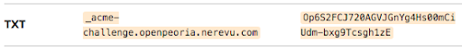

# Setting up HTTPS on CKAN EC2

CKAN uses an Nginx server as a reverse proxy to an Apache server. This means that we will need to configure an HTTPS certificate for our Nginx server instead of our Apache server to get CKAN working on HTTPS.

*[This tutorial](https://www.youtube.com/watch?v=ng5DsxYp-Bk) will give you a basic idea of how reverse proxies work (we're using Apache instead of Node).*

## Prerequisites

- Enable inbound connections on port 443 (HTTPS) for your EC2 instance Security Group rules.
- Knowledge of terminal editors - I use `vim`, but feel free to use `nano` or whatever editor you like.
- Below are the versions for the technologies I'm using. You probably don't need the exact versions.
  - **Nginx** - nginx/1.12.2
  - **Apache Web Server** - Server version: Apache/2.4.41 ()
  - **CKAN** - CKAN 2.8.3 (2020-03-13) delivered by Link Digital (AWS Marketplace)

### Add an Acme Challenge to your DNS
Before you can get a certificate to use HTTPS, you need to verify that you are in control of the domain that you are trying to get a certificate for.

To do this, you will need to complete either an `HTTPS Challenge` or a `DNS Challenge`. We did the [DNS Challenge](https://letsencrypt.org/docs/challenge-types/#dns-01-challenge). An [HTTP Challenge](https://letsencrypt.org/docs/challenge-types/#http-01-challenge) should work fine as well and might make more sense to implement if you understand what [this article](https://letsencrypt.org/docs/challenge-types/) is asking you to do.

For the DNS Challenge, you will need to create a `TXT` record with an Acme challenge.

Add a `TXT` record to your hosting service with a key of `_acme-challenge.{your_live_site}` and a value of `Op6S2FCJ720AGVJGnYg4Hs00mCiUdm-bxg9Tcsgh1zE`.



You should now be prepared to issue a certificate for HTTPS!

## Set up Certbot on your EC2 instance

Certbot is a tool that works with LetsEncrypt to help you issue and renew TLS certificates for free. We will be using this to configure our https certificates. Our CKAN instance is hosted on an Amazon Linux 2 AMI, which is most closely related to Centos Linux distributions. To get Certbot working on your EC2 instance, do the following:

1. Your servers shouldn't be running while getting a certificate.

   ```bash
   sudo systemctl stop nginx
   sudo systemctl stop httpd # apache
   ```

2. Go to https://certbot.eff.org/.

3. Scroll to the section that says `My HTTP website is running ______ on _______`.

4. Change the first box to `Nginx` and the second to `CentOS/RHEL 7`.

5. Scroll down and follow the `default` instructions. Be sure to do the final step as well which automates the renewal of certificates.

   - To install EPEL, follow the instructions in [this tutorial (only step #1)](https://docs.aws.amazon.com/AWSEC2/latest/UserGuide/SSL-on-amazon-linux-2.html#prepare). This worked better for me than the Certbot instructions.

   - When you get to the installation section, run the `certonly` option. This will allow us to configure our web servers the way we want.

     ```bash
     sudo certbot certonly --nginx
     ```

        **IMPORTANT**: When you get to [this section](https://handbook.nerevu.com/ckan-https.html#set-up-certbot-on-your-ec2-instance) that has you put a `cron` job in your crontab to update your SSL certificate automatically, be sure to delete the other cron job that is updating the old SSL certificate.

6. You should get a confirmation that your certificates have been downloaded, with a path to the `fullchain.pem` and `privkey.pem` file locations. Put these file paths somewhere you can access them easily for the next steps.


## Set up your servers to redirect to HTTPS

### Edit your Nginx Config File

Now we need to configure our Nginx and Apache servers to work with HTTPS.

1. Edit the `/etc/nginx/conf.d/ckan.conf` file.

   ```bash
   sudo nano /etc/nginx/conf.d/ckan.conf
   ```

2. We will need to remove the existing server block and add the following server block rule to listen for HTTPS traffic.
   ```nginx
   server {
       listen 443;
       ssl on;
       # REPLACE THESE 2 PATHS WITH THE PATHS YOU COPIED FROM CERTBOT EARLIER
       ssl_certificate /etc/letsencrypt/live/openpeoria.nerevu.com/fullchain.pem;
       ssl_certificate_key /etc/letsencrypt/live/openpeoria.nerevu.com/privkey.pem;

       client_max_body_size 100M;
       location / {
           #redirect all https requests to the apache server hosting our CKAN instance
           proxy_pass http://127.0.0.1:8000/;
           proxy_set_header X-Forwarded-For $remote_addr;
           proxy_set_header Host $host;
           proxy_cache cache;
           proxy_cache_bypass $cookie_auth_tkt;
           proxy_no_cache $cookie_auth_tkt;
           proxy_cache_valid 30m;
           proxy_cache_key $host$scheme$proxy_host$request_uri;
           # In emergency comment out line to force caching
           # proxy_ignore_headers X-Accel-Expires Expires Cache-Control;
       }
   }
   ```

3. Now add another rule for Port 80 (HTTP) traffic that redirects all traffic through the HTTPS rule we just made.

   ```nginx
   server {
       listen 80;
       server_name openpeoria.nerevu.com;
       rewrite ^ https://$server_name$request_uri? permanent;
   }
   ```

   Save and exit this file.

4. Restart your Nginx server.

   ```bash
   sudo systemctl restart nginx
   ```

### Edit Your Apache Config File

If `mod_ssl` is installed on Apache, you will have an `/etc/httpd/conf.d/ssl.conf` file that is listening for HTTPS connections. We want Nginx to handle HTTPS, so we will remove this functionality.

1. Open an editor for `/etc/httpd/conf.d/ssl.conf`.

   ```bash
   sudo nano /etc/httpd/conf.d/ssl.conf
   ```

2. Remove the HTTPS listener

   ```bash
   # remove this line
   Listen 443
   ```

   Save and exit.

3. Comment out the `mod_http2` section of your `/etc/httpd/conf/httpd.conf` file.
   ```bash
   # <IfModule mod_http2.c>
   #    Protocols h2 h2c http/1.1
   # </IfModule>
   ```

4. Restart your Apache server.

   ```bash
   sudo systemctl start httpd
   ```

5. If you are having trouble restarting your server, check the config file by running `apachectl configtest` from the command line. Don't worry if you get an `SSLCertificateFile does not exist` error. Apache isn't handling HTTPS, so we don't need to worry about this.

### Edit your CKAN Installation

After the following two steps, your site should run via https! However, static content may still be loaded via http. We can fix this by changing some settings in the CKAN installation.

1. Change the `ckan.site_url` variable in the `/etc/ckan/default/production.ini` file to your https domain name.

   ```ini
   ## Site Settings
   ckan.site_url = https://openpeoria.nerevu.com
   ```

2. Restart your apache server

   ```bash
   sudo systemctl restart httpd
   ```

## Conclusion

Your site should be up and running now over HTTPS! If you don't see it working immediately, you may have caching issues. Try opening your site in a different browser.

You can also check your site at https://www.whynopadlock.com. This will give you helpful information for troubleshooting.
