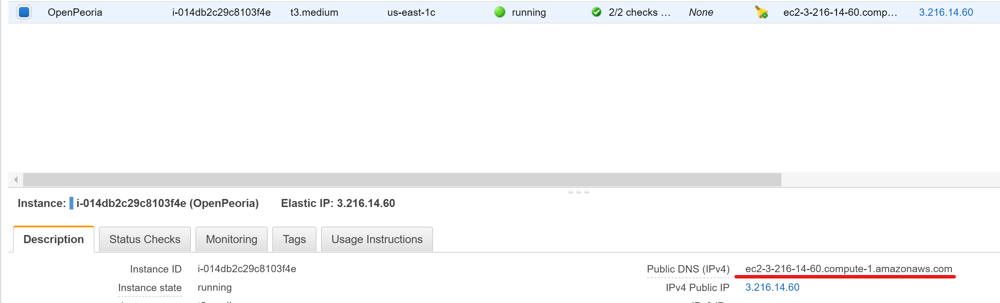

# Making CKAN Live

## Point your live URL to the correct DNS

- Go to the AWS EC2 Dashboard.
- Select your EC2 instance and copy the Public DNS URL.
  
- On your hosting service, create a `CNAME` record with your live site URL. Point it to the Public DNS URL you just copied.
  - Example: `CNAME		data.openpeoria.com`


## Point CKAN Config to your live URL

- SSH into your CKAN EC2 instance.
- Open the `production.ini` file and change the `ckan.site_url` variable.

  ```bash
  sudo nano /lib/ckan/default/src/ckan/production.ini
  ```

  ```ini
  ckan.site_url = {your_live_site}
  # example - ckan.site_url = https://data.openpeoria.com
  ```

- Restart your apache server

   ```bash
   sudo systemctl restart httpd
   ```

## Configure HTTPS

Follow [these instructions](ckan-https) for setting up https.

## Conclusion

After you have followed these instructions, you should see your CKAN instance running at your new live site. Check it out to make sure everything worked.
