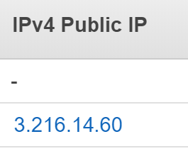
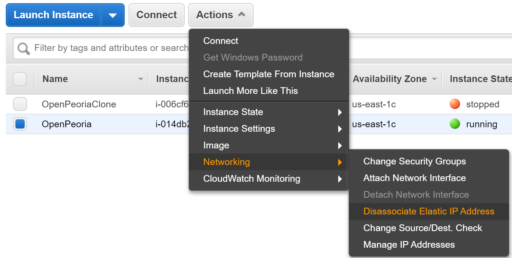
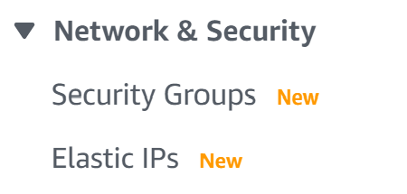
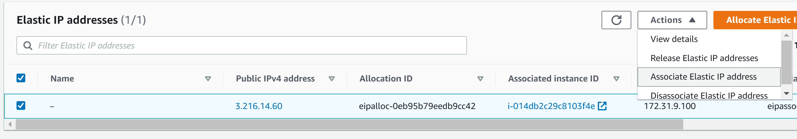
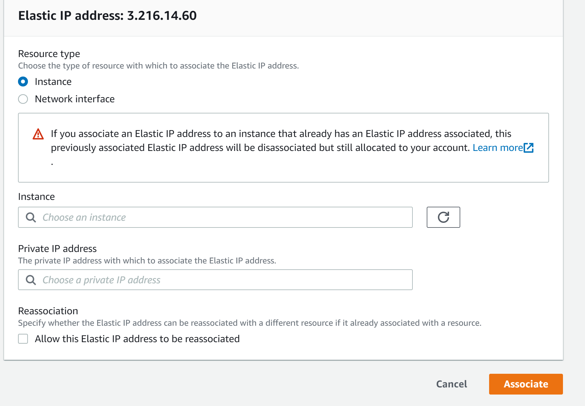

# Upgrading CKAN to a New Instance

The [Official Instructions](https://helpdesk.links.com.au/kb/faq.php?id=15) don't have example code, so I wrote this doc. I am not doing the `in-place` instructions.

You will want 3 terminals open - one logged into the old instance, one logged into the new instance, and one for your local machine.
  ```bash
  # Old Machine
  ssh -i {path/to/private_key} ec2-user@{old_instance_ip}

  # New Machine
  ssh -i {path/to/private_key} ec2-user@{new_instance_ip}
  ```

If you don't have access to key-pair for the old or new machine, [follow these instructions](https://github.com/nerevu/handbook/blob/master/docs/ec2-instance-connect.md#logging-into-ec2-instance-with-different-keys).


## Restore databases from the old to the new instance
1. Export the `ckan_default` and `datastore_default` PostgreSQL databases using [pg_dump](https://www.postgresqltutorial.com/postgresql-backup-database/). When prompted for the password, use the the postgres user's password that was previously set. You can find this password in the `mpsotto.kdbx` KeePassXC database under the `AWS CKAN` folder.
    ```bash
    pg_dump -U postgres -W -F t ckan_default > ~/ckan_default_dump.tar

    pg_dump -U postgres -W -F t datastore_default > ~/datastore_default_dump.tar
    ```

2.  Copy the dump files from the old machine to your new machine (don't forget to change the IP addresses and private keys below)
    ```bash
    # RUN THE FOLLOWING COMMANDS FROM YOUR LOCAL MACHINE
    ###################################################

    # copy the files and directories from your old instance to your local machine
    scp -i {path/to/private_key} ec2-users@{old_instance_ip}:~/ckan_default_dump.tar ~/
    scp -i {path/to/private_key} ec2-users@{old_instance_ip}:~/datastore_default_dump.tar ~/

    # copy the files and directories from your local machine to your new machine
    scp -i {path/to/private_key} ~/ckan_default_dump.tar ec2-users@{new_instance_ip}:~/
    scp -i {path/to/private_key} ~/datastore_default_dump.tar ec2-users@{new_instance_ip}:~/
    ```
    *Learn more about the `scp` command [here.](https://medium.com/dev-blogs/transferring-files-between-remote-server-and-local-system-133d78d58137)*

3.  Drop and recreate the databases in the new machine

    ```bash
    # enter postgres terminal
    sudo -u postgres psql
    ```

    ```sql
    -- drop existing connections to ckan_default, drop the table, then recreate it
    SELECT pg_terminate_backend(pg_stat_activity.pid)
    FROM pg_stat_activity
    WHERE pg_stat_activity.datname = 'ckan_default'
      AND pid <> pg_backend_pid();

    DROP DATABASE ckan_default;

    CREATE DATABASE ckan_default;

    -- drop existing connections to datastore_default, drop the table, then recreate it
    SELECT pg_terminate_backend(pg_stat_activity.pid)
    FROM pg_stat_activity
    WHERE pg_stat_activity.datname = 'datastore_default'
      AND pid <> pg_backend_pid();

    DROP DATABASE datastore_default;

    CREATE DATABASE datastore_default;

    -- Hit Ctrl+Z to exit postgres terminal
    ```

    * *[`pg_terminate_backend` reference](https://stackoverflow.com/a/5408501)*

4. Restore the databases from the old machine to the new machine using [pg_restore](https://www.postgresql.org/docs/9.2/app-pgrestore.html).

    ```bash
    # move dump files to root to make them easily findable
    sudo mv ~/ckan_default_dump.tar /
    sudo mv ~/datastore_default_dump.tar /

    # Change permissions to avoid permissions errors
    sudo chmod 777 /ckan_default_dump.tar
    sudo chmod 777 /datastore_default_dump.tar

    # restore the databases using pg_restore as the postgres user
    sudo -u postgres pg_restore --dbname=ckan_default --create --verbose /ckan_default_dump.tar
    sudo -u postgres pg_restore --dbname=datastore_default --create --verbose /datastore_default_dump.tar
    ```


## Move the Filestore
1. In the old instance, if you have enabled the CKAN filestore, copy it's directory to your home folder.
    - If you're unsure, check `/etc/ckan/default/production.ini` for the `ckan.storage_path` variable to see if it is set. Copy that directory if it is present.

2. Copy the filestore to your new machine (don't forget to change the IP addresses and private keys below)
    ```bash
    # RUN THE FOLLOWING COMMAND FROM YOUR LOCAL MACHINE
    ###################################################

    # copy the files and directories from your old instance to your local machine
    scp -i {path/to/private_key} -r ec2-users@{old_instance_ip}:~/ckan ~/

    # copy the files and directories from your local machine to your new machine
    scp -i {path/to/private_key} -r ~/ckan ec2-users@{new_instance_ip}:~/
    ```
    *Learn more about the `scp` command [here.](https://medium.com/dev-blogs/transferring-files-between-remote-server-and-local-system-133d78d58137)*

3. Extract the filestore archive to the same location on the new instance and set the `ckan.storage_path` value appropriately within the `/etc/ckan/default/production.ini` file. If it is the same name, you don't need to worry about changing the storage_path variable.
    ```bash
    # remove the existing filestore
    sudo rm -rf /var/shared_storage/ckan

    # replace with the old filestore
    sudo mv ~/ckan/ /var/shared_storage/
    ```
4. Set the ckan folder's permissions to `apache:apache` (otherwise datasets won't be able to be added)
    ```bash
    sudo -u root chown -R apache:apache /var/shared_storage/ckan/
    ```


## Move the Promoted Image
1. In the old instance, copy the promoted image to your home directory.
    ```bash
    sudo cp /lib/ckan/default/src/ckan/ckan/public/base/images/promoted-image.jpg ~/
    ```

2. Copy the promoted image to your new machine (don't forget to change the IP addresses and private keys below)
    ```bash
    # RUN THE FOLLOWING COMMAND FROM YOUR LOCAL MACHINE
    ###################################################

    # copy the files and directories from your old instance to your local machine
    scp -i {path/to/private_key} ec2-users@{old_instance_ip}:~/promoted-image.jpg ~/

    # copy the files and directories from your local machine to your new machine
    scp -i {path/to/private_key} ~/promoted-image.jpg ec2-users@{new_instance_ip}:~/
    ```
    *Learn more about the `scp` command [here.](https://medium.com/dev-blogs/transferring-files-between-remote-server-and-local-system-133d78d58137)*

3. Move the promoted image to the images directory
    ```bash
    sudo mv ~/promoted-image.jpg /lib/ckan/default/src/ckan/ckan/public/base/images/
    ```

4. Link to `promoted-image.jpg` in the html snippet containing the promoted image code.
    ```bash
    sudo vim /lib/ckan/default/src/ckan/ckan/templates/home/snippets/promoted.html
    ```
    ```html
    <!-- add the path to promoted-image.jpg -->
    
    ```


## Move any installed extensions
1. Check your old and new ckan instances to see what extensions need to be transferred.
    ```bash
    # anything with ckanext- in the directory name is an extension

    # Old Instance
    ##################################################
    ls /lib/ckan/default/src/
    ... ckan  ckanext-apihelper  ckanext-harvest  ckanext-pages

    # New Instance
    ##################################################
    ls /lib/ckan/default/src/
    ... ckan  ckanext-harvest  ckanext-pages
    ```
    Assuming your two directories looked like the two above, you would need to copy the `ckanext-apihelper` extension to your home folder. You will place this in the same spot in your new instance.
    ```bash
    sudo cp -R /lib/ckan/default/src/ckanext-apihelper ~/
    ```

2. Copy the extensions to your new machine (don't forget to change the IP addresses and private keys below)
    ```bash
    # RUN THE FOLLOWING COMMAND FROM YOUR LOCAL MACHINE
    ###################################################

    # copy the files and directories from your old instance to your local machine
    scp -i {path/to/private_key} -r ec2-users@{old_instance_ip}:~/ckanext-{extension_name} ~/

    # copy the files and directories from your local machine to your new machine
    scp -i {path/to/private_key} -r ~/ckanext-{extension_name} ec2-users@{new_instance_ip}:~/
    ```
    *Learn more about the `scp` command [here.](https://medium.com/dev-blogs/transferring-files-between-remote-server-and-local-system-133d78d58137)*

3. Move the extensions to the proper directory
    ```bash
    sudo mv -R ~/ckanext-{extension_name} /lib/ckan/default/src/
    ```

4. add the extension name to the end of the plugins variable in the CKAN config file
    ```bash
    sudo vim /etc/ckan/default/production.ini
    ```
    ```ini
    ckan.plugins = stats text_view image_view recline_view datastore datapusher resource_proxy geo_view pages harvest ckan_harvester apihelper
    ```


## Final Steps
1. Perform a Solr re-index so the new Solr service contains records of the newly imported data. Use the commands below:
    ```bash
    # activate the python virtualenv and go to the ckan directory
    . /usr/lib/ckan/default/bin/activate
    cd /usr/lib/ckan/default/src/ckan

    # rebuild the index for the database
    paster --plugin=ckan search-index rebuild --config=/etc/ckan/default/production.ini
    ```

2. Disassociate the Elastic IP Address from the old instance and Associate it with the new instance.
    - View your running instances on AWS. Remember the Elastic IP address (copy and paste it somewhere so you don't forget it).

        

    - Select the old instance, click the `Actions` dropdown, click `Networking`, then click `Disassociate Elastic IP address`.

        

    - Select `Elastic IPs` from the sidebar menu under `Networking`.

        

    - Select the same IP Address you just Disassociated from the old instance, click the `Actions` dropdown, then click `Associate Elastic IP address`.

        

    - Select `Instance`, then click into the instance input field and select the new instance.
    - Click into the Private IP input field and select the Private IP of the instance (there will likely only be one option).
    - Click `Associate`.

        

3. Follow [these instructions](https://handbook.nerevu.com/ckan-https.html) to configure HTTPS on the server.

4. Restart the Nginx and Apache servers if you didn't already in the HTTPS setup.
    ```bash
    sudo systemctl restart nginx
    sudo systemctl restart httpd  # apache
    ```


## Check that data was transferred correctly
- [ ] Check that the promoted-image on the [main page](http://openpeoria.nerevu.com) is present.
- [ ] Check that all [ckan users](http://openpeoria.nerevu.com/user/) are still present.
- [ ] Check that all [ckan datasets](http://openpeoria.nerevu.com/dataset) are still present.

## Setup CodeDeploy
- First, you will need to move the `production.ini` to the main CKAN codebase directory and create a symlink to it in the original directory. This is so that you will be able to directly edit the production.ini without having to ssh into the EC2 instance.
    ```bash
    sudo mv /etc/ckan/default/production.ini /lib/ckan/default/src/ckan/

    sudo ln -s /lib/ckan/default/src/ckan/production.ini /etc/ckan/default/production.ini
    ```
- **The rest of the CodeDeploy instructions will come at a later date (when we finish the setup). You can view [this Github Issue](https://github.com/openpeoria/AWS-CKAN/issues/7) for details on progress.**

## Configure HTTPS on the server
- See [this article](https://handbook.nerevu.com/ckan-https.html).
